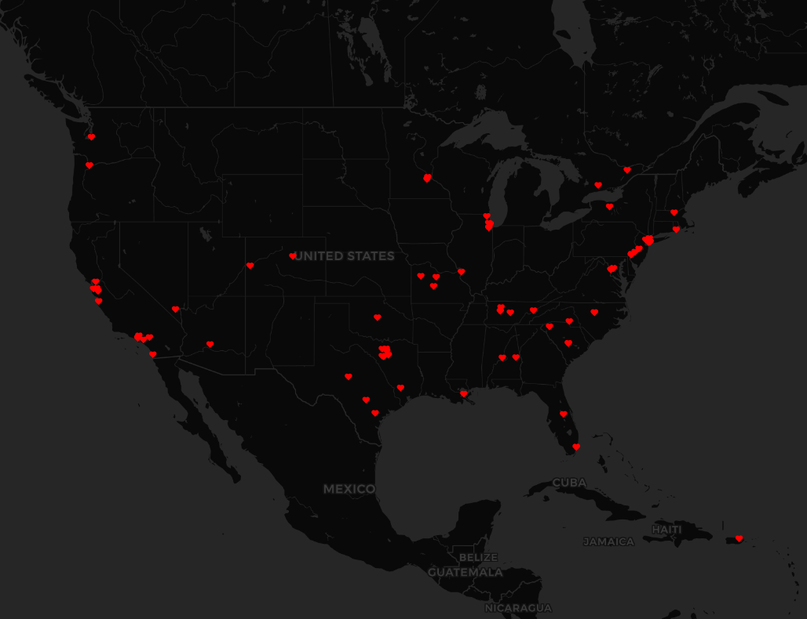

# Tweets of Love <3

A collection of tweets with keyword "love" on January 29, 2021 from 17:19 to 17:22 and 18:08 to 18:10 PST. 

Majority of tweets lie in the US, probably due to language and time zone as well. I think if collection included different hours of day and language, we would see love all over the world. 

### US

## Amor

I decided to collect tweets filtering by keyword "amor" to see the expected difference. Language matters. 
